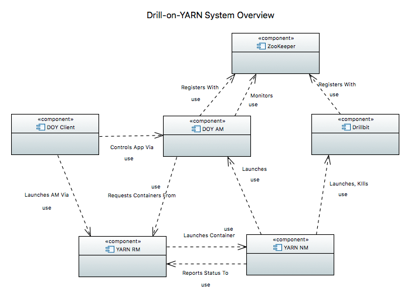
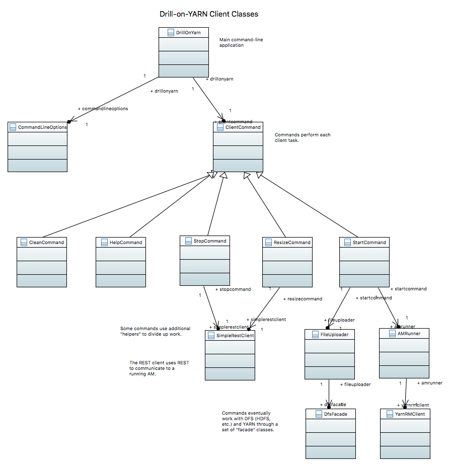
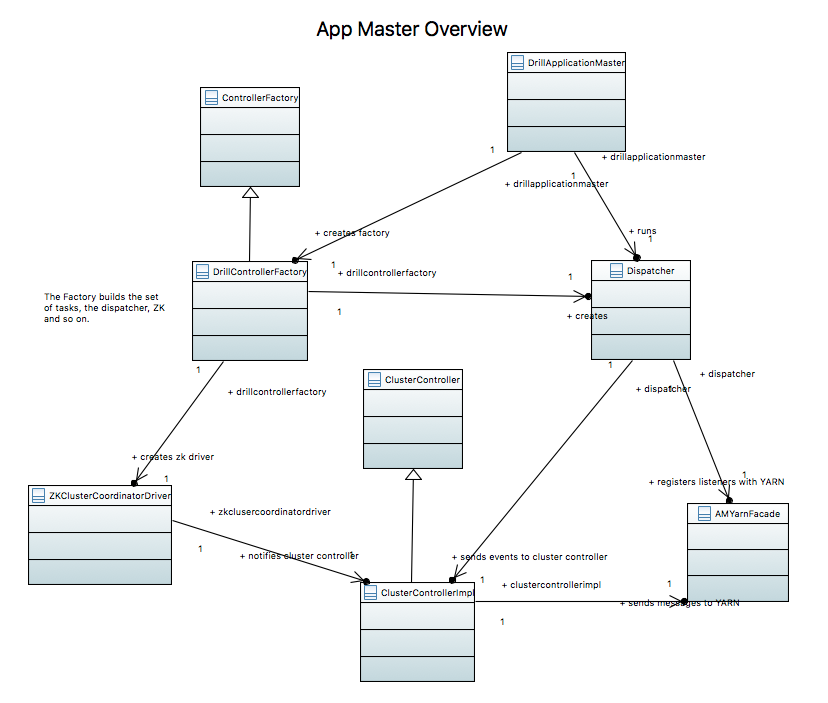
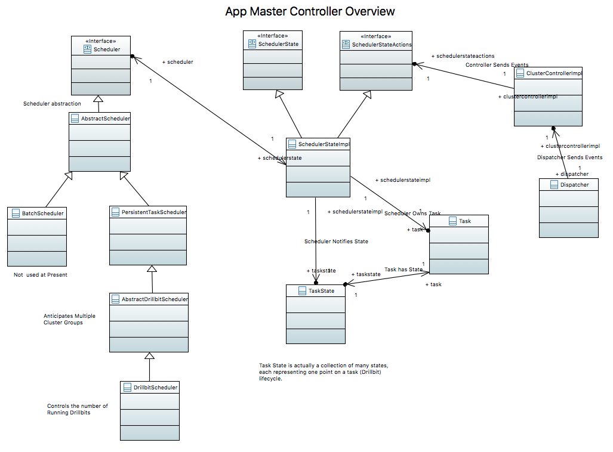

# Drill-on-YARN: YARN Integration for Apache Drill

Drill-on-YARN (DoY) runs Apache Drill as a long-running process under Apache YARN. Key components
include:

1. The Drill-on-YARN client: starts, stops, resizes and checks the status of your Drill cluster.
2. Drill-on-YARN Application Master (AM): a long-running process under YARN that uses YARN
to manage your Drill cluster.
3. Drillbits: The Drill server process, now started by YARN rather than by hand or other
ad-hoc scripts.
4. Configuration: Cluster configuration now resides in a drill-on-yarn.conf.

Extensive user documentation is to be available on the Apache Drill site. Until then,
a user guide is attached to [DRILL-1170](https://issues.apache.org/jira/browse/DRILL-1170).

## Building

Drill-on-YARN builds as part of Apache Drill. The build produces a new DoY jar
which resides in a new `$DRILL_HOME/jars/tools` folder so that the DoY classes are not 
visible to Drill itself.

## Understanding the Code

The DoY code divides into x main modules:

1. The DoY command-line client application.
2. The DoY AM server application.
3. Scripts around the client, AM and Drillbit applications.

Scripts reside in the distribution project under src/resources.

All DoY code resides in this module in the `org.apache.drill.yarn` package.

`client`: The command-line client application.
`appMaster`: The DoY AM.
`core`: Code shared between the client and AM.
`zk`: Integration with ZooKeeper to monitor Drillbits.

DoY depends on Drill modules, but only the `distribution` project depends on
DoY.

### Major Components

The following diagram shows the major DoY components and how they relate to
the YARN components:

The client communicates with the YARN Resource Manager (RM) to request the start
of the DoY AM. The RM locates a node to run the AM's container and asks the
Node Manager (NM) on that node to start the AM. The AM starts and registers
itself with ZooKeeper to prevent multiple AMs for the same Drill cluster.

The AM then requests containers from the RM in which to run Drillbits. The
AM then requests that the assigned NMs start the Drillbit.

The Drillbit starts and registers itself with ZooKeeper. The AM monitors
ZK to confirm that the Drillbit did, in fact, start.

To shut down, the client contacts the AM directly and requests shutdown.
The AM sends a kill request to each NM, which kills the Drillbit processes.
The AM monitors ZK to confirm that the Drillbit has dropped its registration.
Once the last Drillbit has completed, the AM itself exits. The client will
wait (up to a limit) for the AM to shut down so that the client can report
as successful shutdown.

### Client

The client application consists of a main class, `DrillOnYarn` and a set of
command classes. Each command performs one operation, such as start, stop,
resize, and so on. The client is designed to start, perform one operation,
and exit. That is, while the AM is a persistent process, the client is not.

A user will start their Drill cluster, then later will want to stop it. The
Drill cluster is represented by a YARN application, represented by YARN as
an "application id" (app id). To stop a Drill cluster, the client needs the
app id assigned to the application at start time. While the user can use the
-a option to provide it explicitly, it is more convenient to "remember" the
app id. DoY uses an "app id file" for this purpose. This convenience works
if the user starts, manages and stops the cluster from a single host.

The following diagram shows the major classes in the DoY client:

The client uses a "facade" to communicate with YARN. The facade,
`YarnRMClient`, interfaces to YARN to perform the required YARN operations.
Similarly, another facade, `DfsFacade`, provides a layer on top of the HDFS
API. The facades simplify code and provide an abstraction handy for mocking
these systems during unit testing.

YARN simplifies the task of running Drill (or any other application) by
"localizing" the required files onto each worker node. The localization process
starts with the client uploading the files to the distributed file system (DFS),
typically HDFS. DoY localizes two separate files. The first is the Drill software
itself, typically using the original Drill archive from Apache or your distribution.
Drill requires site-specific configuration, optionally including custom code
for UDFS, etc. Site files reside in a Drill site directory. For YARN, the site
directory must be outside of the drill software distribution (see the user
documentation for details.) DoY archives the site directory and uploads it to
DFS along with the Drill archive. The code that does that work resides in the
`FileUploader` class.

To start a Drill cluster, the client asks YARN to launch the AM by specifying
a large number of detailed options: environment variables, files, command
line to run, and so on. This work is done in the `AMRunner` class.

## Application Master

The AM must perform several tasks, including:

* Maintain the desired number of Drillbits.
* Work with YARN to request a container for each Drillbit, and to launch
the Drillbit.
* Ensure that YARN allocates only one Drillbit container per cluster host.
(Required because all Drillbits within a cluster share the same set of ports.)
* Monitor Zookeeper to watch Drillbits. Drillbits perform a heartbeat with
ZK, which the AM can monitor. The AM will restart any Drillbit that drops out
of ZK, since such a Drillbit is likely in a bad state.
* Provide a Web UI to monitor and manage the cluster.
* Provide a REST API that the client uses to communicate directly with the AM.

The AM is composed of a number of components. The following diagram shows the
major classses involved in setting up the AM:

he `DrillApplicationMaster` class is the main AM program. It has to key
tasks: 1) create the `DrillControllerFactory` that assembles the required
parts of the AM, and 2) runs the `Dispatcher`, which is the actual AM server.

The AM is designed to be generic; Drill-specific bits are abstracted out into
helpers. This design simplifies testing and also anticipates that Drill may
eventually include other, specialized, servers. The `DrillControllerFactory`
is the class that pulls together all the Drill-specific pieces to assemble
the server. During testing, different factories are used to assemble a test
server.

The `Dispatcher` receives events from YARN, from the REST API and from a timer
and routes them to the `ClusterController` which takes actions based on the
events. This structure separates the API aspects of working with YARN (in the
`Dispatcher`) from the logic of running a cluster (in the `ClusterController`.)

The `ClusterController` attempts to keep the cluster in the desired state. Today
this means running a specified number of Drillbits. In the future, DoY may
support multiple Drillbit groups (one set that runs all the time, say, and another
that runs only during the day when needed for interactive users.)

A large amount of detailed fiddling is needed to propertly request a container
for a Drillbit, launch the Drillbit, monitor it and shut it down. The `Task`
class monitors the lifecycle of each task (here, a Drillbit). Behavior of the
task differs depending on the task's state. The `TaskState` class, and its
subclasses, provide the task-specific behavior. For example, handling of a
task cancellation is different depending on whether the task is in the
`RequestingState` or in the `RunningState`.

The following diagram illustrates some of the details of the cluster controller
system.

Some events are time based. For example, a Drillbit is given a certain amount
of time to register itself in ZK before DoY assumes that the Drillbit is
unhealthy and is restarted. The `PulseRunnable` is the thread that implements
the timer; `Pollable` is the listener for each "tick" event.

The `Scheduler` and its subclasses (such as `DrillbitScheduler`) maintain the
desired number of Drillbits, asking the `ClusterController` to start and stop
tasks as needed. The `Scheduler` also handles task-specific tasks. At present,
Drill has no means to perform a gracefull shutdown. However, when it does,
the `DrillbitScheduler` will be responsible for sending the required message.

The `appMaster.http` package contains the implementation for the web UI and
REST API usign an embedded Jetty server. If Drill security is enabled, the
web UI will prompt the user to log in. The only recognized user is the one
that launched DoY.

The `NodeRegistry` tracks he set of nodes running Drillbits so we can avoid
starting a second on any of them. Drillbits are started though YARN, of course,
but can also be "stray": Drillbits started outside of DoY and discovered
though ZK. Even stray Drillbits are registered to avoid nasty surprises if
DoY where to try to launch a Drillbit on that same node.
